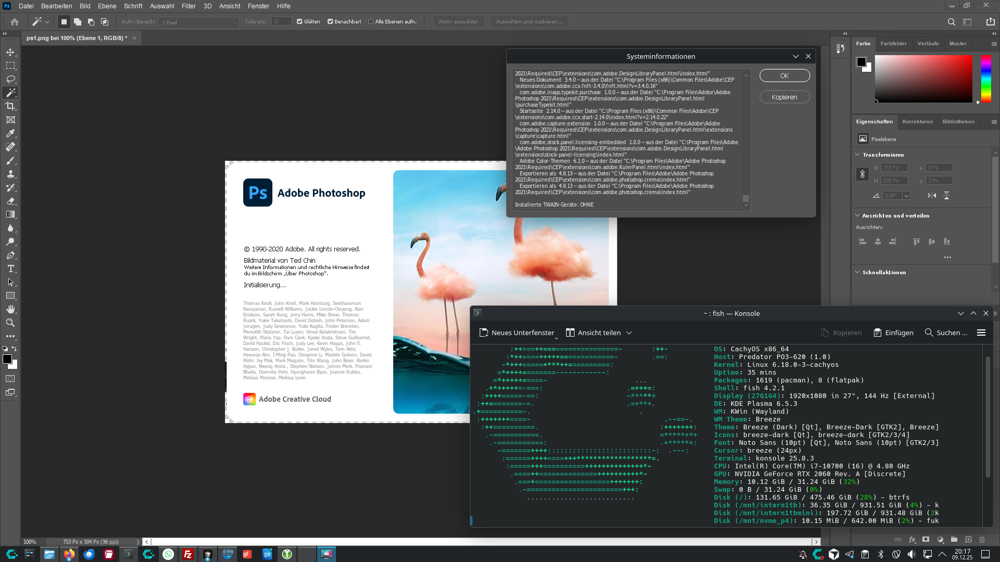

# Adobe Photoshop Installation für Linux

> [!NOTE]
> **Experimenteller Status - Work in Progress**
> 
> Dieses Projekt ist derzeit **experimentell** und in aktiver Entwicklung. Wir haben bereits bedeutende Fortschritte und Erfolge erzielt, stoßen aber weiterhin auf Rückschläge, die weitere Anpassungen erfordern. Wir arbeiten kontinuierlich an Verbesserungen und testen alle möglichen Szenarien.
> 
> **Jeder Hinweis, Fix oder Idee ist willkommen!** Bitte melde Probleme, teile Lösungen oder trage Verbesserungen über [GitHub Issues](https://github.com/benjarogit/photoshopCClinux/issues) bei.
> 
> Dein Feedback hilft, dieses Projekt für alle besser zu machen! 🙏



   

**Adobe Photoshop nativ auf Linux mit Wine ausführen**

Ein einfacher, automatisierter Installer, der dir hilft, Photoshop auf Linux einzurichten. Funktioniert auf CachyOS, Arch, Ubuntu, Fedora und allen großen Linux-Distributionen.

---

## 🌍 Sprachen / Languages

- 🇩🇪 **Deutsche Dokumentation** - Diese Seite
- 🇬🇧 **[English Documentation](README.md)** - Complete guide

---

## ⚠️ WICHTIGER HINWEIS

### Du musst Photoshop-Installationsdateien selbst bereitstellen

**Dieses Repository enthält KEINE Photoshop-Installationsdateien.**

Du musst:
1. **Eine gültige Adobe Photoshop CC 2019 Lizenz besitzen**
2. **Den Installer selbst beschaffen** (siehe [Wie bekomme ich Photoshop?](#wie-bekomme-ich-photoshop))
3. **Dateien im `photoshop/` Verzeichnis platzieren** (siehe [photoshop/README.md](photoshop/README.md))

### ⚡ Versions-Kompatibilität

**Dieser Installer ist für Photoshop CC 2019 (v20.x) optimiert.**

Laut [Wine AppDB](https://appdb.winehq.org/objectManager.php?iId=17&sClass=application) haben verschiedene Photoshop-Versionen unterschiedliche Kompatibilität:

- ✅ **CC 2019 (v20.0)** - Funktioniert mit Workarounds (GPU deaktiviert) - **Dieser Installer**
- ⚠️ **CC 2024** - Eingeschränkte Unterstützung, viele GPU-Probleme
- 🏆 **CS3-CS6** - Bessere Wine-Kompatibilität, aber ältere Features
- ❌ **CC 2020+** - Erhöhte Online-Anforderungen, nicht empfohlen

**Warum CC 2019?**
- Letzte Version vor starker Creative Cloud Integration
- Gutes Feature-Set für professionelle Arbeit
- Funktioniert zuverlässig mit deaktivierter GPU
- Offline-Installation möglich

**Alternative Versionen:**
Falls du Zugriff auf ältere Versionen hast, haben **Photoshop CS6 (13.0)** oder **CS3 (10.0)** bessere Wine-Bewertungen (Silver/Platinum), aber weniger moderne Features.

### Wie bekomme ich Photoshop?

#### Option 1: Offiziell von Adobe (Empfohlen)
- Download über Adobe Creative Cloud
- Offline-Installer für Photoshop CC 2019 (v20.x) verwenden

#### Option 2: Von vorhandener Windows-Installation
- Falls du Photoshop unter Windows hast, extrahiere die Installationsdateien
- Windows-Pfad: `C:\Program Files\Adobe\Adobe Photoshop CC 2019\`

**⚖️ Legal:** Du benötigst eine gültige Lizenz. Dieses Script automatisiert nur die Wine-Installation.

---

## 🚀 Schnellstart

Diese Version verwendet **lokale Installationsdateien** anstatt Downloads.

## ⚠️ Systemanforderungen

### Erforderliche Pakete

```bash
# Für Arch Linux / CachyOS:
sudo pacman -S wine winetricks

# Für Ubuntu/Debian:
sudo apt install wine winetricks

# Für Fedora:
sudo dnf install wine winetricks
```

**Wichtig:** Die folgenden Pakete werden benötigt:
- `wine` (Version 5.0 oder höher empfohlen)
- `winetricks`
- `md5sum` (normalerweise vorinstalliert)

### System-Spezifikationen

- ✅ 64-bit Linux Distribution
- ✅ Mindestens 5 GB freier Speicherplatz in `/home`
- ✅ 4 GB RAM (8 GB empfohlen)
- ✅ Grafikkarte: Intel, Nvidia oder AMD (mit aktuellen Treibern)

## 📦 Installationsdateien

Die Photoshop-Installationsdateien befinden sich in:
```
<projekt-verzeichnis>/photoshop/
```

Diese enthalten:
- `Set-up.exe` - Adobe Photoshop CC 2019 Installer
- `packages/` - Adobe Installationspakete
- `products/` - Photoshop-Produktdateien und Sprachpakete

## 🔧 Installation

### Schritt 1: Internet deaktivieren (WICHTIG!)

Für eine reibungslose Installation wird empfohlen, die Internetverbindung temporär zu deaktivieren:

```bash
# WLAN deaktivieren
nmcli radio wifi off

# Oder Ethernet deaktivieren
sudo ip link set <interface> down
```

### Schritt 2: Setup ausführen

```bash
cd <projekt-verzeichnis>
chmod +x setup.sh
./setup.sh
```

### Schritt 3: Im Menü Option 1 wählen

```
┌─────────────────────────────────────────────┐
│  1) Photoshop CC installieren              │
│  2) Camera Raw v12 installieren            │
│  3) System-Vorprüfung                       │
│  4) Fehlerbehebung                          │
│  5) Wine konfigurieren                      │
│  6) Photoshop deinstallieren                │
│  7) Internet: ON/OFF                        │
│  8) Sprache: Deutsch/English                │
│  9) Beenden                                 │
└─────────────────────────────────────────────┘
```

Wähle **1** für die Photoshop-Installation.


### Schritt 4: Installations-Prozess

Der Installer wird:
1. ✅ Wine-Prefix erstellen (`~/.photoshopCCV19/prefix`)
2. ✅ Mono und Gecko installieren (bestätige mit OK)
3. ✅ Windows 10 Umgebung konfigurieren
4. ✅ Notwendige Komponenten installieren (vcrun, fonts, etc.)
5. ✅ Adobe Photoshop Setup starten

**Im Adobe Setup-Fenster:**
- Wähle "Installieren"
- Behalte den Standard-Pfad (`C:\Program Files\Adobe\...`)
- Wähle deine Sprache (z.B. `de_DE` für Deutsch)
- Warte 10-20 Minuten auf die Installation

### Schritt 5: Internet wieder aktivieren

```bash
# WLAN aktivieren
nmcli radio wifi on
```

## 🎨 Photoshop starten

Nach erfolgreicher Installation kannst du Photoshop auf drei Arten starten:

1. **Terminal-Befehl:**
   ```bash
   photoshop
   ```

2. **Anwendungsmenü:** 
   Suche nach "Adobe Photoshop CC" in deinem Desktop-Menü

3. **Direkter Pfad:**
   ```bash
   ~/.photoshopCCV19/launcher/launcher.sh
   ```

**Hinweis:** Der erste Start kann 1-2 Minuten dauern. Das ist normal!

## 🧪 Experimentell: Proton GE Unterstützung

### Was ist Proton GE?

[Proton GE](https://github.com/GloriousEggroll/proton-ge-custom) ist ein Community-Fork von Valves Proton, optimiert für Gaming, aber auch für Desktop-Anwendungen nützlich. Es kann bessere Kompatibilität als Standard-Wine bieten.

### ⚠️ Experimenteller Status

**Die Proton GE Unterstützung ist derzeit EXPERIMENTELL und funktioniert möglicherweise nicht perfekt für alle Benutzer.**

Wir testen und verbessern die Proton GE Integration aktiv. Falls du Probleme hast:
- Melde sie in [GitHub Issues](https://github.com/benjarogit/photoshopCClinux/issues)
- Versuche Standard-Wine stattdessen (funktioniert meist auch)
- Hilf uns zu verbessern, indem du deine Erfahrungen teilst

### Wie man Proton GE verwendet

1. **Proton GE installieren** (Arch-basierte Systeme):
   ```bash
   yay -S proton-ge-custom-bin
   # oder
   paru -S proton-ge-custom-bin
   ```

2. **Während der Installation**:
   - Der Installer erkennt Proton GE automatisch
   - Du kannst zwischen Proton GE und Standard-Wine wählen
   - Proton GE wird für bessere Kompatibilität empfohlen

3. **Bekannte Einschränkungen**:
   - **Adobe Installer Buttons**: Der Adobe Installer verwendet eine IE-Engine, die möglicherweise nicht perfekt mit Proton GE funktioniert. Falls Buttons nicht reagieren:
     - Installiere IE8 wenn gefragt (dauert 5-10 Minuten, hilft aber)
     - Warte 15-30 Sekunden - der Installer lädt manchmal langsam
     - Verwende Tastaturnavigation: Tab + Enter oder Alt+W/Alt+N
   - **Steam Auto-Start**: Steam startet möglicherweise automatisch bei Proton GE - das ist normal
   - **Winetricks Kompatibilität**: Einige winetricks-Komponenten funktionieren möglicherweise nicht perfekt mit Proton GE

### Mithelfen bei Proton GE Unterstützung

Wir freuen uns über Beiträge zur Verbesserung der Proton GE Unterstützung:

- **Fehler melden**: Einen Bug gefunden? [Öffne ein Issue](https://github.com/benjarogit/photoshopCClinux/issues)
- **Lösungen teilen**: Einen Workaround gefunden? Teile ihn in den Issues!
- **Verschiedene Versionen testen**: Probiere verschiedene Proton GE Versionen und berichte Ergebnisse
- **Dokumentation verbessern**: Hilf uns zu dokumentieren, was funktioniert und was nicht

**Deine Hilfe macht dieses Projekt für alle besser! 🙏**

## 🐛 Bekannte Probleme und Lösungen

Diese Lösungen basieren auf den [GitHub Issues](https://github.com/Gictorbit/photoshopCClinux/issues):

### Problem 1: Photoshop stürzt beim Start ab

**Lösung:** GPU-Beschleunigung deaktivieren
1. Öffne Photoshop
2. Gehe zu `Bearbeiten > Voreinstellungen > Leistung` (oder `Strg+K`)
3. Deaktiviere "Grafikprozessor verwenden"
4. Starte Photoshop neu

**Alternative:** Launcher anpassen
```bash
# Editiere ~/.photoshopCCV19/launcher/launcher.sh
# Diese Zeilen sind bereits aktiviert:
export MESA_GL_VERSION_OVERRIDE=3.3
export __GL_SHADER_DISK_CACHE=0
```

### Problem 2: Fehler "VCRUNTIME140.dll fehlt"

**Lösung:** Visual C++ Runtime neu installieren
```bash
cd <projekt-verzeichnis>
./setup.sh
# Wähle Option 3 (winecfg)
# Oder manuell:
WINEPREFIX=~/.photoshopCCV19/prefix winetricks vcrun2015
```

### Problem 3: Liquify-Tool funktioniert nicht

**Ursache:** GPU-Probleme mit Wine

**Lösung 1:** CPU-Rendering verwenden
- In Photoshop: `Bearbeiten > Voreinstellungen > Leistung`
- Deaktiviere "OpenCL verwenden"

**Lösung 2:** Grafiktreiber aktualisieren
```bash
# Für Nvidia:
sudo pacman -S nvidia nvidia-utils

# Für AMD:
sudo pacman -S mesa vulkan-radeon

# Für Intel:
sudo pacman -S mesa vulkan-intel
```

### Problem 4: Schriftarten sehen verschwommen aus

**Lösung:** Font-Smoothing anpassen
```bash
WINEPREFIX=~/.photoshopCCV19/prefix winetricks fontsmooth=rgb
```

### Problem 5: Installation hängt bei 100%

**Lösung:** 
1. Warte 2-3 Minuten
2. Falls nichts passiert: Installer-Fenster mit `Alt+F4` schließen
3. Überprüfe ob Photoshop trotzdem installiert wurde:
   ```bash
   ls ~/.photoshopCCV19/prefix/drive_c/Program\ Files/Adobe/
   ```

### Problem 6: "ARKServiceAdmin" Fehler während Installation

**Lösung:** 
- Dieser Fehler kann **ignoriert** werden
- Klicke auf "Ignorieren" oder "Fortfahren"
- Die Installation funktioniert trotzdem

### Problem 7: Adobe Creative Cloud Login-Fenster erscheint

**Lösung:**
- **NICHT** anmelden!
- Fenster schließen oder "Offline arbeiten" wählen
- Photoshop funktioniert ohne Login

### Problem 8: Kann nicht als PNG speichern

**Ursache:** Dateiformat-Plugin-Problem in Wine

**Lösung:**
1. Datei > Speichern unter
2. Wähle "PNG" aus Format-Dropdown
3. Falls Fehler: Datei > Exportieren > Exportieren als > PNG
4. Alternative: Als PSD speichern, dann mit GIMP als PNG exportieren

### Problem 9: Bildschirm aktualisiert nicht sofort (Rückgängig/Wiederholen)

**Ursache:** Wine Rendering-Verzögerung

**Lösung:**
- Dies ist eine bekannte Wine-Einschränkung
- Workaround: Aktualisierung erzwingen mit Strg+0 (An Bildschirm anpassen)
- Oder: Virtual Desktop in winecfg aktivieren

### Problem 10: Zoom ist träge

**Ursache:** GPU-Beschleunigung deaktiviert + Wine-Overhead

**Lösung:**
1. Verwende Tastenkürzel (Strg + / Strg -)
2. Zoom mit Mausrad ist langsamer als nativ
3. Dies ist erwartetes Verhalten mit Wine
4. Performance ist besser mit wine-staging

### Problem 11: Adobe Installer "Weiter"-Button reagiert nicht

**Ursache:** Adobe Installer verwendet Internet Explorer Engine (mshtml.dll), die in Wine/Proton nicht perfekt funktioniert

**Lösung:**
```
1. Installiere IE8 wenn gefragt (dauert 5-10 Minuten, hilft aber erheblich)
2. Warte 15-30 Sekunden - Installer lädt manchmal langsam
3. Verwende Tastaturnavigation:
   - Tab-Taste mehrmals drücken, um Button zu fokussieren
   - Enter drücken zum Klicken
   - Oder: Alt+W (Weiter) / Alt+N (Next)
4. Klicke direkt auf den Button (nicht daneben)
5. Installer-Fenster in den Vordergrund bringen (Alt+Tab)
6. Falls nichts hilft: Verwende Standard-Wine statt Proton GE für Installation
```

**Hinweis:** Dies ist eine bekannte Einschränkung von Wine/Proton mit IE-basierten Installern. Der Installer hat bereits DLL-Overrides und Registry-Tweaks konfiguriert, um die Kompatibilität zu verbessern.

## 🎥 Adobe Camera Raw installieren (Optional)

Falls du RAW-Fotos bearbeiten möchtest:

```bash
cd <projekt-verzeichnis>
./setup.sh
# Wähle Option 2
```

Camera Raw wird dann von Adobe heruntergeladen (~400 MB).

## 🗑️ Deinstallation

```bash
cd <projekt-verzeichnis>
./setup.sh
# Wähle Option 4 (Uninstall)
```

Dies entfernt:
- Wine-Prefix (`~/.photoshopCCV19/`)
- Desktop-Eintrag
- Photoshop-Befehl (`/usr/local/bin/photoshop`)

## 📊 Performance-Tipps

### 1. Wine-Staging verwenden (empfohlen)

Wine-Staging bietet bessere Leistung:
```bash
# Arch/CachyOS:
sudo pacman -S wine-staging

# Ubuntu (wine-staging PPA):
sudo add-apt-repository ppa:cybermax-dexter/sdl2-backport
sudo apt install --install-recommends wine-staging
```

### 2. CSMT aktivieren (für Wine-Staging)

```bash
WINEPREFIX=~/.photoshopCCV19/prefix winetricks csmt
```

### 3. Virtual Desktop verwenden

Bei Vollbild-Problemen:
```bash
cd <projekt-verzeichnis>
./setup.sh
# Option 3: Configure wine prefix
# → Graphics Tab → Enable "Emulate a virtual desktop"
# → Setze Auflösung (z.B. 1920x1080)
```

### 4. RAM für Wine erhöhen

Editiere `~/.photoshopCCV19/launcher/launcher.sh` und füge hinzu:
```bash
export WINE_HEAP=512m
export WINE_SHARED_HEAP=128m
```

## 🔍 Logs und Debugging

### Log-Dateien Speicherorte:

- **Setup-Log:** `~/.photoshopCCV19/setuplog.log`
- **Wine-Fehler:** `~/.photoshopCCV19/wine-error.log`
- **Runtime-Log:** `~/.photoshopCCV19/photoshop-runtime.log`

### Logs anzeigen:

```bash
# Setup-Log
cat ~/.photoshopCCV19/setuplog.log

# Wine-Fehler
tail -n 50 ~/.photoshopCCV19/wine-error.log

# Runtime-Fehler
tail -f ~/.photoshopCCV19/photoshop-runtime.log
```

### Debug-Modus aktivieren:

```bash
# Setze Debug-Level
export WINEDEBUG=+all
photoshop
```

## 🌐 Weitere Ressourcen

- **Original Repository:** https://github.com/Gictorbit/photoshopCClinux
- **GitHub Issues:** https://github.com/Gictorbit/photoshopCClinux/issues
- **Wine AppDB:** https://appdb.winehq.org/objectManager.php?sClass=application&iId=17
- **ProtonDB (für Gaming, aber auch nützlich):** https://www.protondb.com/

### Hilfreiche Guides:
- https://www.linuxnest.com/how-to-run-photoshop-on-linux-an-ultimate-guide/
- https://thelinuxcode.com/install_adobe_photoshop_linux/

## 🤝 Mithelfen

**Wir brauchen deine Hilfe!** Dieses Projekt wird durch Beiträge aus der Community besser.

### Wie du helfen kannst

#### 🐛 Fehler melden
Etwas funktioniert nicht? Lass es uns wissen!
- [Öffne ein GitHub Issue](https://github.com/benjarogit/photoshopCClinux/issues)
- Bitte angeben: Linux-Distribution, Wine-Version, Fehler-Logs, Schritte zur Reproduktion
- Auch wenn du dir nicht sicher bist - melde es trotzdem!

#### 💡 Features vorschlagen
Hast du eine Idee, wie wir das besser machen können?
- [Öffne einen Feature-Request](https://github.com/benjarogit/photoshopCClinux/issues)
- Beschreibe was du dir wünschst
- Erkläre warum es hilfreich wäre

#### 🔧 Fixes & Workarounds teilen
Eine Lösung für ein Problem gefunden?
- Teile sie in den [GitHub Issues](https://github.com/benjarogit/photoshopCClinux/issues)
- Hilf anderen mit dem gleichen Problem
- Deine Erfahrung hilft allen!

#### 📝 Dokumentation verbessern
Etwas in der README unklar gefunden?
- [Öffne ein Issue](https://github.com/benjarogit/photoshopCClinux/issues) oder sende einen Pull Request
- Hilf dabei, das für Anfänger einfacher zu machen
- Übersetze in andere Sprachen

#### 💻 Code beitragen
Möchtest du Code beitragen?
1. Forke das Repository
2. Erstelle einen Feature-Branch
3. Teste deine Änderungen gründlich
4. Sende einen Pull Request mit klarer Beschreibung

**Jeder Beitrag, groß oder klein, macht dieses Projekt besser! 🙏**

## 📝 Wichtige Hinweise

- ⚠️ Dies ist **keine offizielle Adobe-Installation**
- ⚠️ Einige Funktionen (wie 3D, Cloud-Sync) funktionieren möglicherweise nicht
- ⚠️ Halte deine Wine-Version aktuell für beste Kompatibilität
- ✅ Die meisten Core-Photoshop-Funktionen funktionieren einwandfrei
- ✅ Plugins können installiert werden (in `~/.photoshopCCV19/prefix/drive_c/...`)

## 🎉 Viel Erfolg!

Die Installation sollte problemlos funktionieren. Bei Fragen oder Problemen schaue zuerst in die "Bekannte Probleme" Sektion.

**Tipp:** Deaktiviere GPU-Beschleunigung in Photoshop, wenn du Stabilitätsprobleme hast!

---

## 📄 Lizenz & Copyright

**Copyright © 2024 benjarogit**

Dieses Projekt ist unter der **GPL-3.0 Lizenz** lizenziert.

Basiert auf [photoshopCClinux](https://github.com/Gictorbit/photoshopCClinux) von Gictorbit.

---

**Mit ❤️ für die Linux-Community**

**Gib diesem Repo einen Stern ⭐ wenn es dir geholfen hat!**


