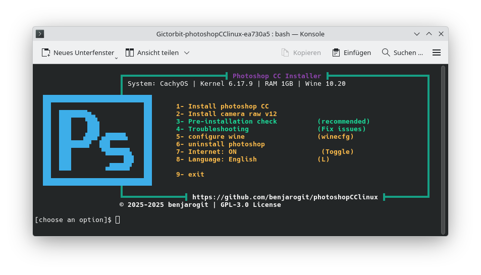

# Adobe Photoshop Installer for Linux 

> [!NOTE]
> **Experimental Status - Work in Progress**
> 
> This project is currently **experimental** and under active development. We have achieved significant progress and success, but continue to encounter setbacks that require further adjustments. We are continuously working on improvements and testing all possible scenarios.
> 
> **Every hint, fix, or idea is welcome!** Please report issues, share solutions, or contribute improvements via [GitHub Issues](https://github.com/benjarogit/photoshopCClinux/issues).
> 
> Your feedback helps make this project better for everyone! 🙏

> [!IMPORTANT]
> **Verified Working Version**
> 
> ✅ **Adobe Photoshop CC 2021 v22.0.0.35 x64** has been successfully tested and confirmed working with **Wine Standard** installation method.
> 
> ✅ **Proton GE Support**: Proton GE installation is now working successfully! Users can install and run Photoshop using Proton GE. Proton GE is automatically installed if not found.
> 
> ✅ **Tested on**: CachyOS Linux (Arch-based) with KDE desktop environment
> 
> ⚠️ **Known Issue**: Icon display issue in KDE desktop environment - icons may not appear in start menu or desktop shortcut. Workaround: Restart desktop session or log out and log back in.


   

**Run Adobe Photoshop natively on Linux using Wine**

A simple, automated installer that helps you set up Photoshop on Linux. Works on CachyOS, Arch, Ubuntu, Fedora, and all major Linux distributions.

---

## 🌍 Languages / Sprachen

- 🇬🇧 **[English Documentation](#english-documentation)** - See below
- 🇩🇪 **[Deutsche Dokumentation](README.de.md)** - Vollständige Anleitung

---

# English Documentation

## 📋 Table of Contents

- [Features](#-features)
- [System Requirements](#-system-requirements)
- [Important Notice](#-important-notice)
- [Quick Start](#-quick-start)
- [Installation Guide](#-installation-guide)
- [Known Issues & Solutions](#-known-issues--solutions)
- [Troubleshooting](#-troubleshooting)
- [Performance Tips](#-performance-tips)
- [Uninstallation](#-uninstallation)
- [Contributing](#-contributing)
- [License](#-license)

---

## ✨ Features

- ✅ **Local Installation** - Uses local installation files (no downloads from Adobe)
- ✅ **Automatic Setup** - Installs Wine components and dependencies automatically
- ✅ **Multi-Distribution Support** - Works on CachyOS, Arch, Ubuntu, Fedora, and more
- ✅ **Pre-Installation Check** - Validates system before installation
- ✅ **Automatic Troubleshooting** - Built-in diagnostic tools
- ✅ **Desktop Integration** - Creates menu entry and terminal command
- ✅ **GPU Workarounds** - Fixes for common graphics issues
- ✅ **Multi-Language** - Supports all Photoshop language packs
- 🧪 **Experimental: Proton GE Support** - Optional Proton GE integration for improved compatibility (see [Proton GE Support](#-experimental-proton-ge-support))

---

## 🖥️ System Requirements

### Required

- **OS:** 64-bit Linux distribution
- **RAM:** Minimum 4 GB (8 GB recommended)
- **Storage:** 5 GB free space in `/home`
- **Graphics:** Any GPU (Intel, Nvidia, AMD) with up-to-date drivers

### Required Packages

<details>
<summary><b>CachyOS / Arch Linux</b></summary>

```bash
sudo pacman -S wine winetricks
``` 
</details>

<details>
<summary><b>Ubuntu / Debian / Linux Mint</b></summary>

```bash
sudo apt install wine winetricks
```
</details>

<details>
<summary><b>Fedora / RHEL</b></summary>

```bash
sudo dnf install wine winetricks
```
</details>

<details>
<summary><b>openSUSE</b></summary>

```bash
sudo zypper install wine winetricks
```
</details>

---

## ⚠️ Important Notice

### You Must Provide Photoshop Installation Files

**This repository does NOT include Photoshop installation files.**

You must:
1. **Own a valid Adobe Photoshop CC 2019 license**
2. **Obtain the installer yourself** (see [How to Get Photoshop](#how-to-get-photoshop-files))
3. **Place files in `photoshop/` directory** (see [photoshop/README.md](photoshop/README.md))

### ⚡ Version Compatibility

**This installer is optimized for Photoshop CC 2019 (v20.x).**

According to [Wine AppDB](https://appdb.winehq.org/objectManager.php?iId=17&sClass=application), different Photoshop versions have varying compatibility:

- ✅ **CC 2019 (v20.0)** - Works with workarounds (GPU disabled) - **This installer**
- ⚠️ **CC 2024** - Limited support, many GPU issues
- 🏆 **CS3-CS6** - Better Wine compatibility, but older features
- ❌ **CC 2020+** - Increased online requirements, not recommended

**Why CC 2019?**
- Last version before heavy Creative Cloud integration
- Good feature set for professional work
- Works reliably with GPU disabled
- Offline installation possible

**Alternative Versions:**
If you have access to older versions, **Photoshop CS6 (13.0)** or **CS3 (10.0)** have better Wine ratings (Silver/Platinum), but lack modern features.

### How to Get Photoshop Files

#### Option 1: Official Adobe (Recommended)
- Download from Adobe Creative Cloud
- Get offline installer for Photoshop CC 2019 (v20.x)

#### Option 2: Existing Installation
- If you have Photoshop on Windows, extract installation files
- Windows location: `C:\Program Files\Adobe\Adobe Photoshop CC 2019\`

**⚖️ Legal:** You must have a valid license. This script only automates Wine installation.

---

## 🚀 Quick Start

### 1. Clone Repository

```bash
git clone https://github.com/benjarogit/photoshopCClinux.git
cd photoshopCClinux
```

### 2. Place Photoshop Files

Copy your Photoshop CC 2019 installation files to `photoshop/` directory:

```
photoshop/
├── Set-up.exe
├── packages/
└── products/
```

See [photoshop/README.md](photoshop/README.md) for detailed structure.

### 3. Run Pre-Check

```bash
chmod +x pre-check.sh
./pre-check.sh
```

Should show: ✅ "All critical checks passed!"

### 4. Disable Internet (Recommended)

```bash
# WiFi
nmcli radio wifi off

# Or Ethernet
sudo ip link set <interface> down
```

This prevents Adobe login prompts during installation.

### 5. Run Installation

```bash
chmod +x setup.sh
./setup.sh
```

### 6. In the Menu, Select Option 1

```
┌─────────────────────────────────────────────┐
│  1) Install photoshop CC                   │
│  2) Install camera raw v12                 │
│  3) Pre-installation check                 │
│  4) Troubleshooting                        │
│  5) Configure wine                         │
│  6) Uninstall photoshop                    │
│  7) Internet: ON/OFF                       │
│  8) Language: English/Deutsch              │
│  9) Exit                                   │
└─────────────────────────────────────────────┘
```

Select **Option 1** (install photoshop CC)



### 7. In Adobe Setup Window

- Click "Install"
- Keep default path (`C:\Program Files\Adobe\...`)
- Select your language (e.g., en_US or de_DE)
- Wait 10-20 minutes

### 8. Re-enable Internet

```bash
nmcli radio wifi on
```

### 9. Launch Photoshop

```bash
photoshop
```

Or search for "Adobe Photoshop CC" in your application menu.

### 10. Disable GPU (Important!)

For stability:
1. In Photoshop: `Edit > Preferences > Performance` (Ctrl+K)
2. Uncheck "Use Graphics Processor"
3. Restart Photoshop

---

## 📖 Installation Guide

### Detailed Steps

#### Pre-Installation

1. **Install Required Packages**
   ```bash
   # CachyOS/Arch
   sudo pacman -S wine winetricks
   
   # Ubuntu/Debian
   sudo apt install wine winetricks
   ```

2. **Check System**
   ```bash
   ./pre-check.sh
   ```
   
   This validates:
   - 64-bit architecture
   - Wine/winetricks installation
   - Available disk space
   - RAM
   - Installation files presence

#### During Installation

1. **Wine Configuration**
   - Mono installer will appear → Click "Install"
   - Gecko installer will appear → Click "Install"
   - Wine config window → Set to Windows 10, click OK

2. **Component Installation** (automatic, ~10 minutes)
   - vcrun2010, vcrun2012, vcrun2013, vcrun2015
   - fonts and font-smoothing
   - msxml3, msxml6, gdiplus

3. **Adobe Photoshop Setup** (10-20 minutes)
   - Adobe installer window appears
   - Click "Install"
   - Choose language
   - Wait for completion
   - **Ignore** "ARKServiceAdmin" errors if they appear

#### Post-Installation

1. **Run Troubleshoot**
   ```bash
   ./troubleshoot.sh
   ```

2. **Launch Photoshop**
   ```bash
   photoshop
   ```
   
   First launch takes 1-2 minutes (normal!)

3. **Disable GPU**
   - Edit > Preferences > Performance
   - Uncheck "Use Graphics Processor"

---

## 🧪 Experimental: Proton GE Support

### What is Proton GE?

[Proton GE](https://github.com/GloriousEggroll/proton-ge-custom) is a community fork of Valve's Proton, optimized for gaming but also useful for desktop applications. It can provide better compatibility than standard Wine for some applications.

### ⚠️ Experimental Status

**Proton GE support is currently EXPERIMENTAL and may not work perfectly for all users.**

We're actively testing and improving Proton GE integration. If you encounter issues:
- Report them in [GitHub Issues](https://github.com/benjarogit/photoshopCClinux/issues)
- Try using Standard Wine instead (usually works fine)
- Help us improve by sharing your experience

### How to Use Proton GE

1. **Install Proton GE** (Arch-based systems):
   ```bash
   yay -S proton-ge-custom-bin
   # or
   paru -S proton-ge-custom-bin
   ```

2. **During Installation**:
   - The installer will detect Proton GE automatically
   - You can choose between Proton GE and Standard Wine
   - Proton GE is recommended for better compatibility

3. **Known Limitations**:
   - **Adobe Installer Buttons**: The Adobe installer uses an IE engine that may not work perfectly with Proton GE. If buttons don't respond:
     - Install IE8 when prompted (takes 5-10 minutes, but helps)
     - Wait 15-30 seconds for the installer to load
     - Use Tab + Enter or Alt+N/Alt+W to navigate
   - **Steam Auto-Start**: Steam may start automatically when using Proton GE - this is normal
   - **Winetricks Compatibility**: Some winetricks components may not work perfectly with Proton GE

### Contributing to Proton GE Support

We welcome contributions to improve Proton GE support:

- **Report Issues**: Found a bug? [Open an issue](https://github.com/benjarogit/photoshopCClinux/issues)
- **Share Solutions**: Found a workaround? Share it in the issues!
- **Test Different Versions**: Try different Proton GE versions and report results
- **Improve Documentation**: Help us document what works and what doesn't

**Your help makes this project better for everyone! 🙏**

---

## 🐛 Known Issues & Solutions

### Issue 1: Photoshop Crashes on Startup

**Cause:** GPU acceleration incompatibility with Wine

**Solution:**
```
1. Launch Photoshop
2. Edit > Preferences > Performance (Ctrl+K)
3. Uncheck "Use Graphics Processor"
4. Uncheck "Use OpenCL"
5. Restart Photoshop
```

### Issue 2: "VCRUNTIME140.dll is missing"

**Cause:** Visual C++ Runtime not installed properly

**Solution:**
```bash
WINEPREFIX=~/.photoshopCCV19/prefix winetricks vcrun2015
```

### Issue 3: Liquify Tool Doesn't Work

**Cause:** GPU/OpenCL issues

**Solution:**
- Disable GPU acceleration (see Issue 1)
- Or disable OpenCL: Preferences > Performance > Uncheck "Use OpenCL"

### Issue 4: Blurry/Ugly Fonts

**Solution:**
```bash
WINEPREFIX=~/.photoshopCCV19/prefix winetricks fontsmooth=rgb
```

### Issue 5: Installation Hangs at 100%

**Solution:**
- Wait 2-3 minutes
- If nothing happens, close installer (Alt+F4)
- Installation is likely complete
- Verify: `ls ~/.photoshopCCV19/prefix/drive_c/Program\ Files/Adobe/`

### Issue 6: "ARKServiceAdmin" Error During Installation

**Solution:**
- This error can be **ignored**
- Click "Ignore" or "Continue"
- Installation will complete successfully

### Issue 7: Slow First Startup (1-2 Minutes)

**Not an Issue:**
- First startup is always slow
- Subsequent starts take 10-30 seconds
- This is normal Wine behavior

### Issue 8: Cannot Save as PNG

**Cause:** File format plugin issue in Wine

**Solution:**
```
1. File > Save As
2. Choose "PNG" from format dropdown
3. If it fails, try: File > Export > Export As > PNG
4. Alternative: Save as PSD, then use GIMP to export as PNG
```

### Issue 9: Screen Doesn't Update Immediately (Undo/Redo)

**Cause:** Wine rendering lag

**Solution:**
- This is a known Wine limitation
- Workaround: Force refresh with Ctrl+0 (fit to screen)
- Or: Enable virtual desktop in winecfg

### Issue 10: Zooming is Laggy

**Cause:** GPU acceleration disabled + Wine overhead

**Solution:**
```
1. Use keyboard shortcuts (Ctrl + / Ctrl -)
2. Zoom with mouse wheel is slower than native
3. This is expected behavior with Wine
4. Performance is better on wine-staging
```

### Issue 11: Adobe Installer "Next" Button Doesn't Respond

**Cause:** Adobe installer uses Internet Explorer engine (mshtml.dll) which doesn't work perfectly in Wine/Proton

**Solution:**
```
1. Install IE8 when prompted (takes 5-10 minutes, but significantly helps)
2. Wait 15-30 seconds - installer sometimes loads slowly
3. Use keyboard navigation:
   - Tab key multiple times to focus the button
   - Press Enter to click
   - Or: Alt+N (Next) / Alt+W (Weiter in German)
4. Click directly on the button (not beside it)
5. Bring installer window to foreground (Alt+Tab)
6. If nothing works: Use Standard Wine instead of Proton GE for installation
```

**Note:** This is a known limitation of Wine/Proton with IE-based installers. The installer has already configured DLL-overrides and registry tweaks to improve compatibility.

---

## 🔧 Troubleshooting

### Automatic Troubleshooting

```bash
./troubleshoot.sh
```

This tool:
- ✅ Checks system requirements
- ✅ Validates installation
- ✅ Analyzes Wine configuration
- ✅ Scans logs for errors
- ✅ Applies automatic fixes when possible
- ✅ Provides detailed reports

### Manual Troubleshooting

#### Check Logs

```bash
# Setup log
cat ~/.photoshopCCV19/setuplog.log

# Wine errors
tail -n 50 ~/.photoshopCCV19/wine-error.log

# Runtime errors
tail -n 30 ~/.photoshopCCV19/photoshop-runtime.log
```

#### Wine Configuration

```bash
./setup.sh  # Select Option 5
```

Recommended settings:
- **Windows Version:** Windows 10
- **DPI:** 96 (default)
- **Virtual Desktop:** Optional (enable if fullscreen issues)

#### Reinstall Components

```bash
WINEPREFIX=~/.photoshopCCV19/prefix winetricks --force vcrun2015 msxml6
```

---

## 🚀 Performance Tips

### Essential (For Stability)

1. **Disable GPU in Photoshop** (Ctrl+K → Performance)
2. **Disable OpenCL** (Ctrl+K → Performance)

### Optional (For Speed)

3. **Use Wine-Staging**
   ```bash
   # CachyOS/Arch
   sudo pacman -S wine-staging
   
   # Ubuntu
   sudo add-apt-repository ppa:cybermax-dexter/sdl2-backport
   sudo apt install wine-staging
   ```

4. **Enable CSMT**
   ```bash
   WINEPREFIX=~/.photoshopCCV19/prefix winetricks csmt
   ```

5. **Use Virtual Desktop** (if performance issues)
   ```bash
   ./setup.sh  # Option 5 → Graphics → Enable virtual desktop
   ```

### Expected Performance

| Feature | Native Windows | Wine Linux | Notes |
|---------|---------------|------------|-------|
| Basic Tools | 100% | 90-95% | Excellent |
| Filters | 100% | 80-90% | Good |
| Liquify | 100% | 70-80% | Usable (GPU off) |
| 3D Features | 100% | 30-50% | Limited |
| Camera Raw | 100% | 60-80% | Usable |
| Startup Time | 5-10s | 10-30s | After first launch |

**Overall:** 85-90% of native performance for standard photo editing.

---

## 🗑️ Uninstallation

### Complete Removal

```bash
./setup.sh  # Select Option 6
```

This removes:
- Wine prefix (`~/.photoshopCCV19/`)
- Desktop entry
- Terminal command (`/usr/local/bin/photoshop`)

### Manual Removal

```bash
# Remove installation
rm -rf ~/.photoshopCCV19/

# Remove desktop entry
rm ~/.local/share/applications/photoshop.desktop

# Remove command
sudo rm /usr/local/bin/photoshop
```

---

## 🤝 Contributing

**We need your help!** This project is made better by contributions from the community.

### How You Can Help

#### 🐛 Report Bugs
Found something that doesn't work? Let us know!
- [Open a GitHub Issue](https://github.com/benjarogit/photoshopCClinux/issues)
- Include: Linux distro, Wine version, error logs, steps to reproduce
- Even if you're not sure it's a bug - report it anyway!

#### 💡 Suggest Features
Have an idea to make this better?
- [Open a Feature Request](https://github.com/benjarogit/photoshopCClinux/issues)
- Describe what you'd like to see
- Explain why it would be helpful

#### 🔧 Share Fixes & Workarounds
Found a solution to a problem?
- Share it in the [GitHub Issues](https://github.com/benjarogit/photoshopCClinux/issues)
- Help others who have the same problem
- Your experience helps everyone!

#### 📝 Improve Documentation
Found something unclear in the README?
- [Open an Issue](https://github.com/benjarogit/photoshopCClinux/issues) or submit a pull request
- Help make this easier for beginners
- Translate to other languages

#### 💻 Code Contributions
Want to contribute code?
1. Fork the repository
2. Create a feature branch
3. Test your changes thoroughly
4. Submit a pull request with a clear description

**Every contribution, big or small, makes this project better! 🙏**

---

## 📚 Additional Resources

### Official Resources

- **German Documentation:** [README.de.md](README.de.md)
- **Quick Start Guide:** [START_HIER.md](START_HIER.md) (DE) or quick start section above
- **Testing Guide:** [TESTING.md](TESTING.md)
- **Wine AppDB:** [Photoshop on Wine](https://appdb.winehq.org/objectManager.php?iId=17&sClass=application)

### Alternative Solutions

If this installer doesn't work for you, consider these alternatives:

- **[PhotoGIMP](https://github.com/Diolinux/PhotoGIMP)** - GIMP configured to look/feel like Photoshop
- **[Krita](https://krita.org/)** - Professional painting and illustration (native Linux)
- **[Photopea](https://www.photopea.com/)** - Online Photoshop alternative (browser-based)
- **Older Photoshop Versions** - CS6 or CS3 have better Wine compatibility (see Wine AppDB)

### Community & Helpful Guides

- [How to Run Photoshop on Linux](https://www.linuxnest.com/how-to-run-photoshop-on-linux-an-ultimate-guide/)
- [Install Adobe Photoshop on Linux](https://thelinuxcode.com/install_adobe_photoshop_linux/)
- [Original Gictorbit Project](https://github.com/Gictorbit/photoshopCClinux)

---

## 📄 License

This project is licensed under the **GPL-2.0 License** - see the [LICENSE](LICENSE) file for details.

### Legal Notice

- ⚠️ Adobe Photoshop is proprietary software owned by Adobe Inc.
- ⚠️ You must have a valid license to use Photoshop
- ⚠️ This script only automates Wine installation
- ⚠️ No piracy is supported or encouraged
- ✅ Use at your own risk

---

## 🙏 Acknowledgments

- **[Gictorbit](https://github.com/Gictorbit)** - Original installer script
- **Wine Team** - Windows compatibility layer
- **Community Contributors** - Bug reports and fixes

---

## 📊 Project Status


**Status:** ✅ Production Ready

**Tested on:**
- CachyOS (Primary)
- Arch Linux
- Ubuntu 22.04+
- Fedora 38+
- Other major distributions

---

## ❓ FAQ

<details>
<summary><b>Q: Do I need an Adobe account?</b></summary>

You need a valid Photoshop license, but you can use the offline installer without logging in during installation. Disable internet connection during setup.
</details>

<details>
<summary><b>Q: Which Photoshop version works?</b></summary>

Photoshop CC 2019 (v20.x) is tested and recommended. Other versions may not work properly.
</details>

<details>
<summary><b>Q: Can I use plugins?</b></summary>

Most plugins work. Install them to: `~/.photoshopCCV19/prefix/drive_c/Program Files/Adobe/Adobe Photoshop CC 2019/Plug-ins/`
</details>

<details>
<summary><b>Q: Does Camera Raw work?</b></summary>

Yes! After Photoshop installation, run `./setup.sh` and select Option 2 to install Camera Raw.
</details>

<details>
<summary><b>Q: Why is GPU disabled?</b></summary>

Wine has limited GPU acceleration support. Disabling it prevents crashes and improves stability.
</details>

<details>
<summary><b>Q: Can I use the latest Photoshop version?</b></summary>

Photoshop 2020+ has increased Adobe login requirements and may not work well offline. CC 2019 is the sweet spot for Linux.
</details>

---

## 💬 Support

- 🐛 **Bug Reports:** [GitHub Issues](https://github.com/benjarogit/photoshopCClinux/issues)
- 💡 **Feature Requests:** [GitHub Issues](https://github.com/benjarogit/photoshopCClinux/issues)
- 📖 **Documentation:** See files in this repository
- 🔧 **Automatic Help:** Run `./troubleshoot.sh`

---

## 📄 License & Copyright

**Copyright © 2024 benjarogit**

This project is licensed under the **GPL-3.0 License**.

Based on [photoshopCClinux](https://github.com/Gictorbit/photoshopCClinux) by Gictorbit.

---

**Made with ❤️ for the Linux community**

**Star ⭐ this repo if it helped you!**


